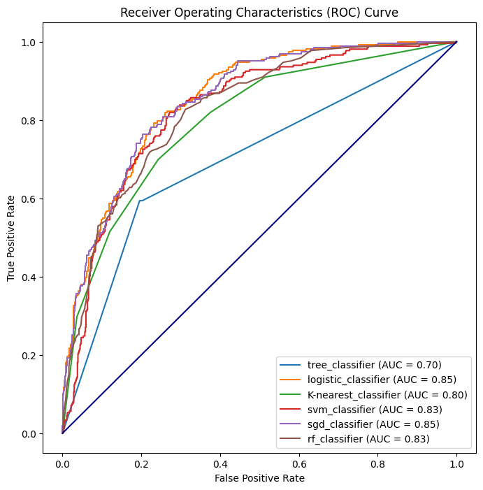

# Predictive Modelling of Customer Churn and Retention Strategies for Vodafone Corporation

# Table of Contents

1. [Business Understanding](#business-understanding)
    
    1.1 [Dataset Overview](#dataset-overview)
    
    1.2 [Hypothesis and Questions](#hypothesis-and-questions)
2. [Code Dependencies and Libraries](#code-dependencies-and-libraries)
3. [Data Source & Understanding](#data-source--understanding)
4. [Data Preprocessing](#data-preprocessing)
5. [Data Preparation: Feature Selection and Splitting](#data-preparation-feature-selection-and-splitting)
6. [Feature Categorization](#feature-categorization)
7. [Feature Transformation and Preprocessing](#feature-transformation-and-preprocessing)
8. [Model Evaluation](#model-evaluation)
    
    8.1 [Dataset Balancing using RandomOverSampler](#dataset-balancing-using-randomoversampler)
    
    8.2 [SMOTE Oversampling for Minority Class](#smote-oversampling-for-minority-class)
9. [Key Insights](#key-insights)
10. [Feature Selection](#feature-selection)
    
    10.1 [Results of Feature Selection](#results-of-feature-selection)
11. [Model Evaluation and ROC Curve](#model-evaluation-and-roc-curve)
    
    11.1 [Receiver Operating Characteristics (ROC) Curve](#receiver-operating-characteristics-roc-curve)
    
    11.2 [Model Selection and Recommendation](#model-selection-and-recommendation)
    
    11.3 [Logistic Regression Model Evaluation with Threshold](#logistic-regression-model-evaluation-with-threshold)
12. [Hyperparameter Tuning with Grid Search](#hyperparameter-tuning-with-grid-search)
    
    12.1 [Best Hyperparameters and Model Evaluation](#best-hyperparameters-and-model-evaluation)
13. [Tableau Visualization](#tableau-visualization)
14. [License](#license)
15. [Author](#author)


## Business Understanding

As a leading telecommunication corporation, Vodafone recognizes the criticality of customer retention in sustaining business growth. The escalating issue of customer churn can have a detrimental impact on a company's revenue and profitability, as acquiring new customers is often more costly than retaining existing ones. To address this challenge, this project aims to assist Vodafone in analyzing customer churn patterns, identifying factors influencing churn, and developing effective customer retention strategies by leveraging machine learning techniques.

The primary objective is to develop robust machine-learning models to predict customer churn accurately. By analyzing historical customer data, the aim is to identify key indicators of churn and formulate targeted retention strategies to reduce customer attrition and achieve higher profitability.

## Dataset Overview

This dataset includes various features providing information such as:

- **Gender:** Whether the customer is male or female.
- **SeniorCitizen:** Whether a customer is a senior citizen or not.
- **Partner:** Whether the customer has a partner (Yes, No).
- **Dependents:** Whether the customer has dependents (Yes, No).
- **Tenure:** Number of months the customer has stayed with the company.
- **Phone Service:** Whether the customer has a phone service (Yes, No).
- **MultipleLines:** Whether the customer has multiple lines.
- **InternetService:** Customer’s internet service provider (DSL, Fiber Optic, No).
- **OnlineSecurity:** Whether the customer has online security.
- **OnlineBackup:** Whether the customer has online backup.
- **DeviceProtection:** Whether the customer has device protection.
- **TechSupport:** Whether the customer has tech support.
- **StreamingTV:** Whether the customer has streaming TV.
- **StreamingMovies:** Whether the customer has streaming movies.
- **Contract:** The contract term of the customer (Month-to-Month, One year, Two years).
- **PaperlessBilling:** Whether the customer has paperless billing (Yes, No).
- **Payment Method:** The customer’s payment method (Electronic check, mailed check, Bank transfer(automatic), Credit card(automatic)).
- **MonthlyCharges:** The amount charged to the customer monthly.
- **TotalCharges:** The total amount charged to the customer.
- **Churn:** Whether the customer churned or not (Yes or No).

# Hypothesis and Questions

## Hypothesis

* **Null Hypothesis (H0):** There is no significant difference in churn rates between customers with longer contract terms and those using the payment method (Automatic).

* **Alternative Hypothesis (H1):** There is a significant difference in churn rates between customers with longer contract terms and those using the payment method (Automatic).

## Questions

1. **How do contract terms and payment methods correlate with customer churn?**
2. **Are there specific services that significantly impact churn rates?**
3. **Are there specific services that customers with longer contract terms tend to use more frequently?**
4. **Do customers using automatic payment methods show different churn patterns compared to other payment methods?**
5. **Are senior citizens more or less likely to churn compared to non-senior citizens?**

# Code Dependencies and Libraries

The project utilizes various libraries and tools for data handling, visualization, hypothesis testing, and machine learning. Below is a list of key libraries used in the project:

- **pyodbc:** For connecting to the database.
- **pandas:** For data manipulation and analysis.
- **numpy:** For numerical operations.
- **dotenv:** For loading environment variables.
- **seaborn:** For statistical data visualization.
- **matplotlib:** For creating static, animated, and interactive visualizations.
- **plotly:** For interactive plots.
- **scipy:** For scientific and technical computing.
- **sklearn:** For machine learning models and utilities.
- **imblearn:** For handling class imbalance in the dataset.
- **joblib:** For saving and loading models.
- **os:** For interacting with the operating system.
- **pickle:** For serializing and deserializing Python objects.

Make sure to install these libraries using the appropriate package manager (e.g., pip) before running the code.

```bash
pip install pyodbc pandas numpy seaborn matplotlib plotly scipy scikit-learn imbalanced-learn joblib
```
# Data Source & Understanding

The datasets for this project were sourced from the following locations:

1. **GitHub:**
2. **Microsoft SQL Server:**
3. **CSV file from Onedrive:**

# Data Preprocessing

The initial dataset exhibited inconsistencies such as null values and incorrect data types in certain columns. To address these issues, the following preprocessing steps were undertaken:

1. **Handling Null Values:** Null values in the dataset were imputed using the `SimpleImputer` tool, ensuring a comprehensive approach to missing data.

2. **Correcting Data Types:** Columns with incorrect data types were identified and corrected to maintain uniformity and accuracy in the dataset.

These necessary corrections were organized into a pipeline, ensuring a systematic and reproducible approach to data preprocessing. The pipeline facilitates the application of the same preprocessing steps when dealing with new datasets.

3. **Categorical to Numerical Conversion:** To enable efficient machine learning model training, categorical columns in the dataset were transformed into numerical values. This transformation was achieved using both `OneHotEncoder` and `LabelEncoder` to encode categorical features.

These preprocessing steps contribute to a clean and standardized dataset, setting the stage for effective machine learning model training and evaluation.

# Data Preparation: Feature Selection and Splitting

To prepare the data for machine learning model training, the following steps were performed:

1. **Drop Unnecessary Columns:** Columns irrelevant to the prediction task, such as 'Churn' (the target variable), were removed to isolate the features. This was done using the `drop` method.

2. **Splitting the Data:** The dataset was split into features (X) and the target variable (y). The target variable 'Churn' was separated from the features. Additionally, boolean values in the target variable were converted to strings to facilitate further processing.

3. **Train-Test Split:** The data was divided into training and testing sets using the `train_test_split` function from `sklearn`. This division ensures a separate set for training the machine learning model and evaluating its performance. The `stratify` parameter was utilized to maintain the distribution of the target variable in both the training and testing sets.

```python
# Drop unnecessary columns and split the data
X = df.drop(['Churn'], axis=1)  # Features
y = df['Churn']  # Target variable

# Convert boolean values to strings
y_stratify = y.astype(str)

# Split the data into training and testing sets
X_train, X_test, y_train, y_test = train_test_split(X, y, test_size=0.2, random_state=42, stratify=y_stratify)
```

# Feature Categorization

To facilitate effective feature engineering and preprocessing, the features in the dataset were categorized into numerical and categorical columns:

1. **Numerical Columns (X_num_cols):** Columns containing numerical data types were identified using the `select_dtypes` method with `include=np.number`. These columns are crucial for numerical computations and statistical analysis.

2. **Categorical Columns (X_cat_cols):** Categorical features, representing non-numeric data, were identified using the `select_dtypes` method with `include=['object']`. These columns typically include information like text or categories and may require specific encoding techniques for machine learning model training.

```python
# Identify Numerical Columns
X_num_cols = X.select_dtypes(include=np.number).columns

# Identify Categorical Columns
X_cat_cols = X.select_dtypes(include=['object']).columns
```

# Feature Transformation and Preprocessing

To ensure the data is ready for machine learning model training, feature transformation and preprocessing were performed using custom transformers and pipelines:

1. **Numerical Transformer with Log Transformation:**
   - A `LogTransformer` class was implemented to apply a logarithmic transformation to numerical features, mitigating skewness and enhancing the model's performance.
   - The numerical pipeline includes:
      - Median imputation using `SimpleImputer`.
      - Logarithmic transformation using the custom `LogTransformer`.
      - Standard scaling using `StandardScaler`.

2. **Boolean to String Transformer:**
   - A `BooleanToStringTransformer` class was created to convert boolean values to strings, ensuring compatibility with downstream processing.
   - This transformer is part of the categorical pipeline.

3. **Categorical Transformer:**
   - The categorical pipeline comprises:
      - Conversion of boolean values to strings using the custom transformer.
      - Most frequent imputation for missing values using `SimpleImputer`.
      - One-hot encoding using `OneHotEncoder`.

4. **Combining Transformers:**
   - The `ColumnTransformer` combines the numerical and categorical transformers, applying them to their respective columns.

5. **Label Encoding Target Variable:**
   - The target variable 'Churn' was label-encoded using `LabelEncoder` to convert categorical values into numerical representations.

```python
# Numerical transformer with LogTransformer
numerical_pipeline = Pipeline(steps=[
    ('num_imputer', SimpleImputer(strategy='median')),
    ('log_transform', FunctionTransformer(LogTransformer().transform)),
    ('scaler', StandardScaler())
])

# Categorical transformer
categorical_pipeline = Pipeline(steps=[
    ('bool_to_str', BooleanToStringTransformer()),
    ('cat_imputer', SimpleImputer(strategy='most_frequent')),
    ('cat_encoder', OneHotEncoder())
])

# Combine transformers
preprocessor = ColumnTransformer(
    transformers=[
        ('num', numerical_pipeline, X_num_cols),
        ('cat', categorical_pipeline, X_cat_cols)
    ])

# Label Encoding Target Variable
label_encoder = LabelEncoder()
y_train_encoded = label_encoder.fit_transform(y_train)
y_test_encoded = label_encoder.transform(y_test)
```
# Model Evaluation

A variety of classification models were evaluated to identify the most suitable one for predicting customer churn. The following models were considered:

1. **Decision Tree Classifier**
2. **Logistic Regression**
3. **K-Nearest Neighbors Classifier**
4. **Support Vector Machine (SVM) Classifier**
5. **Stochastic Gradient Descent (SGD) Classifier**
6. **Random Forest Classifier**

The evaluation process involves training each model using a common preprocessing pipeline and assessing their performance on the test set. The models are evaluated based on precision, recall, F1-score, and accuracy.

```python
# List of models to evaluate
models = [
    ('tree_classifier', DecisionTreeClassifier(random_state=42)),
    ('logistic_classifier', LogisticRegression(random_state=42)),
    ('K-nearest_classifier', KNeighborsClassifier()),
    ('svm_classifier', SVC(random_state=42, probability=True)),
    ('sgd_classifier', SGDClassifier(random_state=42)),
    ('rf_classifier', RandomForestClassifier(random_state=42))
]

# Iterate through models
for model_name, classifier in models:
    pipeline = Pipeline(steps=[
        ('preprocessor', preprocessor),
        ('classifier', classifier)                
    ])
    
    # Train the model
    pipeline.fit(X_train, y_train_encoded)

    # Make predictions
    y_pred = pipeline.predict(X_test)

    # Print classification report
    print(f'Report for {model_name}')
    print(classification_report(y_test_encoded, y_pred))
    print('=' * 58)
```
# Dataset Balancing using RandomOverSampler

To address the class imbalance in the dataset, a RandomOverSampler was employed to balance the number of samples for each class. This technique generates synthetic samples for the minority class, ensuring a more equitable representation during model training.

```python
# Balance the dataset using RandomOverSampler
sampler = RandomOverSampler(random_state=42)
X_train_resampled, y_train_resampled = sampler.fit_resample(X_train, y_train_encoded)

# List of models to evaluate on the balanced dataset
models = [
    ('tree_classifier', DecisionTreeClassifier(random_state=42)),
    ('logistic_classifier', LogisticRegression(random_state=42)),
    ('K-nearest_classifier', KNeighborsClassifier()),
    ('svm_classifier', SVC(random_state=42, probability=True)),
    ('sgd_classifier', SGDClassifier(random_state=42)),
    ('rf_classifier', RandomForestClassifier(random_state=42))
]

# Iterate through models on the balanced dataset
for model_name, classifier in models:
    pipeline = Pipeline(steps=[
        ('preprocessor', preprocessor),
        ('classifier', classifier)                
    ])
    
    # Train the model
    pipeline.fit(X_train_resampled, y_train_resampled)

    # Make predictions
    y_pred = pipeline.predict(X_test)

    # Print classification report
    print(f'Report for {model_name}')
    print(classification_report(y_test_encoded, y_pred))
    print('=' * 58)
```
### Key Insights
* Balancing the dataset positively impacted the models, especially in their ability to identify customers who will churn, as evidenced by improved recall for the 'Yes' class.
* The logistic_classifier and svm_classifier emerged as standout models, showcasing balanced improvements in both precision and recall for the 'Yes' class.

# SMOTE Oversampling for Minority Class

## Initializing SMOTE

To address the class imbalance more comprehensively, the Synthetic Minority Over-sampling Technique (SMOTE) was employed. SMOTE generates synthetic samples for the minority class, aiding in creating a more balanced representation for improved model performance.

```python
# Initialize SMOTE for oversampling the minority class
smote = SMOTE(random_state=42)
```
## Model Evaluation with SMOTE
The models were re-evaluated with SMOTE applied within the pipeline, showcasing the impact of oversampling the minority class on their performance.

```python
# List of models to evaluate with SMOTE
models = [
    ('tree_classifier', DecisionTreeClassifier(random_state=42)),
    ('logistic_classifier', LogisticRegression(random_state=42)),
    ('K-nearest_classifier', KNeighborsClassifier()),
    ('svm_classifier', SVC(random_state=42, probability=True)),
    ('sgd_classifier', SGDClassifier(random_state=42)),
    ('rf_classifier', RandomForestClassifier(random_state=42))
]

# Iterate through models and apply SMOTE within the pipeline
for model_name, classifier in models:
    pipeline = impipeline(steps=[
        ('preprocessor', preprocessor),
        ('smote', SMOTE(random_state=42)),
        ('classifier', classifier)                
    ])
    
    # Train the model
    pipeline.fit(X_train, y_train_encoded)

    # Make predictions
    y_pred = pipeline.predict(X_test)

    # Print classification report
    print(f'Report for {model_name}')
    print(classification_report(y_test_encoded, y_pred))
    print('=' * 58)
```
# Key Insights

## Impact of Dataset Balancing

### SMOTE Oversampling

- Balancing the dataset with SMOTE has significantly improved the models, especially in their ability to identify customers who are likely to churn, showcasing notable improvements in recall for the 'Yes' class.

### Standout Models

- Among the models evaluated with SMOTE, the logistic_classifier, svm_classifier, and sgd_classifier emerge as standout performers, demonstrating a balanced enhancement in both precision and recall for the 'Yes' class.

## Comparative Analysis of Sampling Techniques

### SMOTE vs. RandomOverSampler

- Generally, both SMOTE and RandomOverSampler have positively influenced the models' capacity to identify potential churners, particularly by enhancing recall for the 'Yes' class compared to the original imbalanced dataset.

- Notably, SMOTE tends to yield slightly better recall values for the 'Yes' class across most models when compared to RandomOverSampler.

These insights underline the importance of addressing class imbalance in the dataset and suggest that SMOTE may offer a slight advantage in improving the models' ability to predict customer churn.

# Feature Selection

To enhance model efficiency and interpretability, the project includes feature selection using the `SelectKBest` method with mutual information as the scoring function. This step is essential for identifying the most relevant features that contribute to predicting customer churn.

## Results of Feature Selection

### Selected Features

The feature selection process has identified a subset of 15 features deemed most influential in predicting customer churn. These features are crucial for optimizing model performance and simplifying the model without compromising predictive accuracy.

### Impact on Model Performance

After incorporating feature selection into the pipeline, the models were re-evaluated to assess their performance. Each model, including logistic_classifier, svm_classifier, and sgd_classifier, showcased consistent or improved performance in terms of precision, recall, and overall accuracy.

# Model Evaluation and ROC Curve

## Receiver Operating Characteristics (ROC) Curve

The project includes an evaluation of model performance using ROC curves. The ROC curve visually illustrates the trade-off between true positive rate (sensitivity) and false positive rate across different probability thresholds.

### Interpretation

- The ROC curve showcases the performance of each model, including logistic_classifier, svm_classifier, and sgd_classifier, in distinguishing between customers who will churn and those who will not.

- The Area Under the Curve (AUC) values are indicative of the models' ability to discriminate between positive and negative instances. Higher AUC values represent better model performance.



## Model Selection and Recommendation

Our exploration into customer churn prediction involved the evaluation of diverse machine learning classifiers. Among these classifiers, the logistic regression model consistently distinguished itself, demonstrating superior performance, particularly in terms of recall for predicting churned customers.

### Insight:

From the ROC curve analysis, the Logistic Classifier emerges as the preferred model for predicting customer churn. This conclusion is drawn based on its robust overall performance, striking a balance between precision and recall for both churn and non-churn classes.

The Logistic Classifier demonstrates:

- **High Discrimination Ability:** With a ROC AUC value of 0.85, the Logistic Classifier excels in distinguishing between positive and negative instances.

- **Comprehensive Performance Metrics:** Precision, recall, and F1-score metrics provide a thorough assessment of the model's effectiveness.

### Recommendation:

Utilizing the Logistic Classifier as the primary model for predicting customer churn is recommended. This choice optimally identifies potential churners while minimizing false positives, contributing to a more accurate and actionable churn prediction strategy.

## Logistic Regression Model Evaluation with Threshold

To further fine-tune the Logistic Regression model, a specific threshold (0.28) was applied to the predicted probabilities. Here is the resulting confusion matrix:

```python
threshold = 0.28

y_pred_proba = logistic_pipeline.predict_proba(X_test)[:, 1]

binary_prediction = (y_pred_proba >= threshold)

threshold_matrix = confusion_matrix(y_test_encoded, binary_prediction)
print(threshold_matrix)
```
## Hyperparameter Tuning with Grid Search

Hyperparameter tuning was performed using Grid Search to optimize the Logistic Regression model. The following parameter grid was explored:

```python
param_grid = {
    'feature_importance__k': [5, 10, 20],
    'classifier__C': [0.001, 0.01, 0.1, 1, 10, 100],
    'classifier__penalty': ['l1', 'l2'],
    'classifier__max_iter': [100, 200, 300],
}
grid_search = GridSearchCV(
    logistic_pipeline,
    param_grid=param_grid,
    cv=5,
    scoring='f1')

grid_search.fit(X_train, y_train_encoded)
```
The grid search was conducted with 5-fold cross-validation, and the scoring metric was set to F1-score. After an exhaustive search, the best hyperparameters were identified to enhance the model's performance.
These optimized hyperparameters contribute to the model's ability to generalize well and improve its effectiveness in predicting customer churn.

## Best Hyperparameters and Model Evaluation

After the hyperparameter tuning with Grid Search, the best hyperparameters for the Logistic Regression model were determined. Here are the optimal settings:

```python
best_parameters = grid_search.best_params_
print("Best Hyperparameters:", best_parameters)

best_estimator = grid_search.best_estimator_
```
The best estimator represents the Logistic Regression model with the identified hyperparameters. Additionally, the model's performance was evaluated on the test set, and the accuracy was calculated.
```python
test_accuracy = best_estimator.score(X_test, y_test_encoded)
print("Test Accuracy:", test_accuracy)
```
These results reflect the effectiveness of the tuned Logistic Regression model in predicting customer churn on unseen data.

# Tableau Visualization
Explore dynamic visual representations of our Customer Churn Prediction project at this Tableau link. https://public.tableau.com/views/Customer_churn_project_lp2/Dashboard1?:language=en-US&publish=yes&:display_count=n&:origin=viz_share_link

# License
This project is licensed under the MIT License - see the LICENSE file for details.

# AUTHOR
Efosa Dave Omosigho